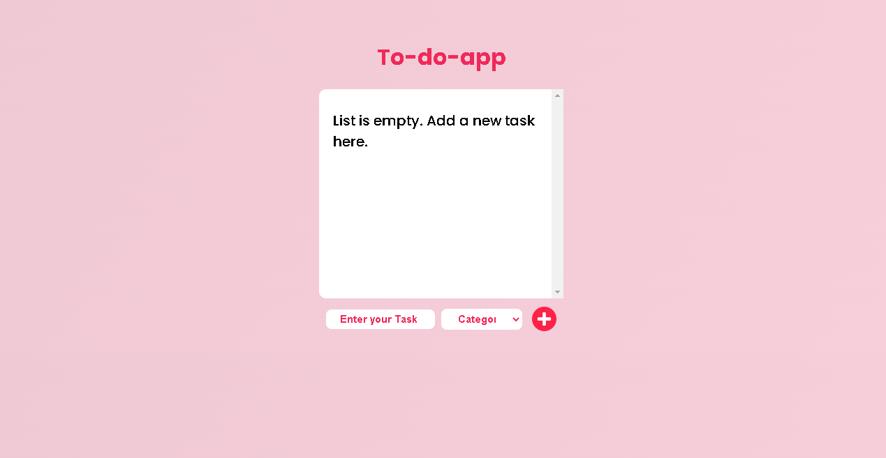

# TODO LIST
 # To-Do Application

This is a simple To-Do application built with React that allows users to add, categorize, and delete tasks. The application uses local storage to persist data across sessions and includes user notifications for interactions.

## Table of Contents
- [Usage](#usage)
- [Features](#features)
- [Libraries and Tools](#libraries-and-tools)
- [Components](#components)
- [State Management](#state-management)
- [User Notifications](#user-notifications)
- [Acknowledgements](#acknowledgements)


## Usage

1. Open the application in your browser:
    ```bash
    http://localhost:3000
    ```

2. Add a new task by typing in the task input field and selecting a category from the dropdown. Click the add button to save the task.

3. View the list of tasks. Tasks are categorized and displayed accordingly.

4. Delete a task by clicking the delete button next to the task. Confirm the deletion in the popup dialog.

## Features

- **Add Task**: Add new tasks with categories.
- **Delete Task**: Delete tasks with confirmation dialog.
- **Persistent Storage**: Tasks are saved in local storage.
- **User Notifications**: Notifications for actions like adding or deleting tasks.

## Libraries and Tools

### Frontend

- **React**: A JavaScript library for building user interfaces.
- **React Hooks**: `useState` and `useEffect` for state management and side effects.
- **SweetAlert2**: For elegant popup dialogs.
- **React Hot Toast**: For toast notifications.
- **CSS Modules**: For styling components.

### Others

- **Local Storage**: For persistent data storage in the browser.

## Components

### Home Component

This is the main component of the application, responsible for rendering the UI and managing the state of the to-do list.



### State Management
- **useState**: Used to manage the state of todoList, newTask, and category.
- **useEffect**: Used to persist the to-do list to local storage and load it from local storage when the component mounts.

### Acknowledgements
- React
- React Hot Toast
- SweetAlert2
- CSS Modules
- Local Storage